# Cycle Odometer

An iPhone cycling computer: a big speed gauge you can read at a glance, ride
tracking and history, saved routes with turn-by-turn cues, navigation to any place,
and a Live Activity for the Lock Screen and Dynamic Island.

Built with SwiftUI and MapKit for iOS 26.

<table>
  <tr>
    <td>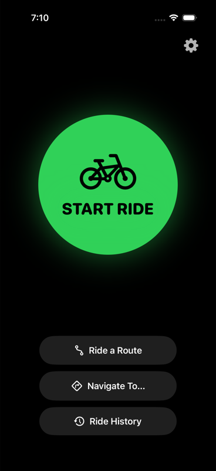</td>
    <td>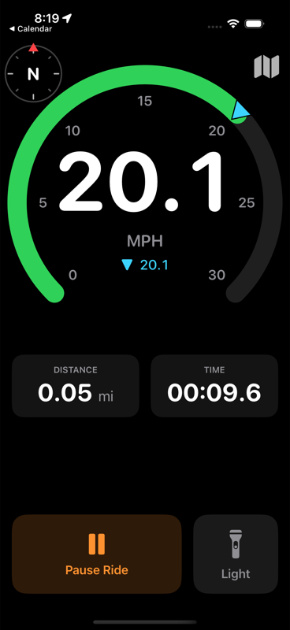</td>
    <td>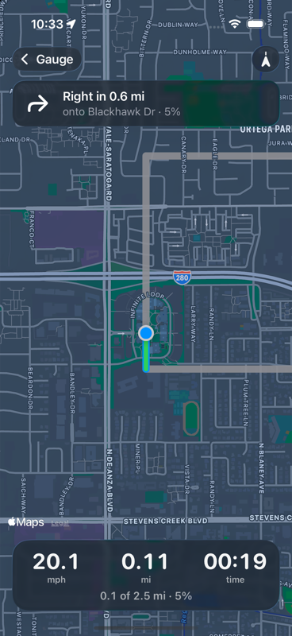</td>
  </tr>
  <tr>
    <td align="center">Start</td>
    <td align="center">Riding</td>
    <td align="center">Live map and turn cues</td>
  </tr>
</table>

## Features

### Riding

- **Speed gauge** from 0 to 30 mph (Competitive) or 0 to 15 mph (Casual), or 0 to 50 or 25 km/h, with a marker for your top speed.
- **Distance, stopwatch and road grade.** The grade uses the barometer, e.g. ↗ 6%.
- **Compass** in the corner, showing the direction you're heading.
- **Pause and resume.** While paused, you end a ride by dragging a slider, so a bump can't end it by accident.
- **Flashlight.** Tap to turn it on or off. Long-press for a **red flashing warning screen**.
- **Screen stays on**, and GPS keeps recording with the phone locked.

### Ride history

The last 20 rides are kept, each with its time, distance, top speed and average speed. Tap a ride to see its track on a map, then swipe left or right to move between rides. Any ride can be saved as a route.

<table>
  <tr>
    <td>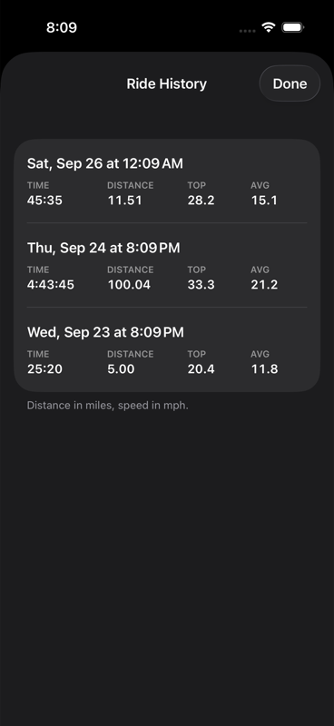</td>
    <td>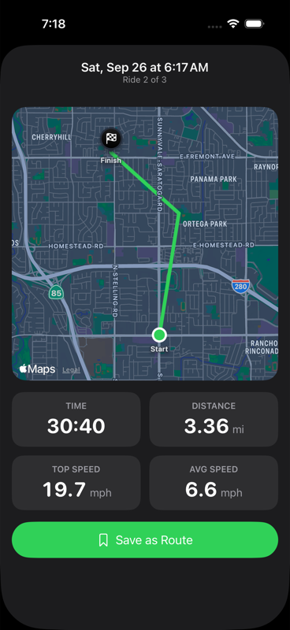</td>
    <td>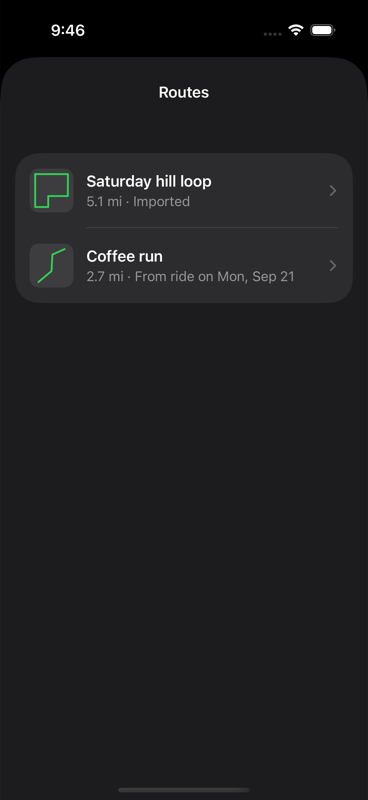</td>
  </tr>
  <tr>
    <td align="center">History</td>
    <td align="center">A ride, with Save as Route</td>
    <td align="center">Saved routes</td>
  </tr>
</table>

### Routes

- **Save or import.** Save a ride as a route, or import a **GPX** file from Strava, Komoot, Ride with GPS, Files, AirDrop and so on.
- **Share.** Send a route as a GPX file, open it in Google Maps (approximated to up to 9 of its turns), or get directions to its start in your preferred directions app.
- **Ride a route.**
  - **On the map:** the route is drawn under your track, with the part you've ridden highlighted.
  - **Progress:** e.g. "3.2 of 11.5 mi · 28%".
  - **Off-route alerts:** an arrow points you back to the route.
- **Turn cues.**
  - **Wording:** e.g. "Right in 400 ft · onto Main St".
  - **Street names** come from Apple's directions, looked up once per route.
  - **Warnings:** a haptic tap and an optional voice prompt at about 150 m and again at 30 m.
- **Ride to Start:** in-app directions to a route's start. After a minute off route, you also get directions back onto it.

<table>
  <tr>
    <td>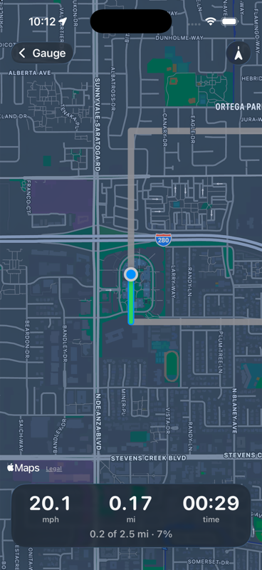</td>
    <td>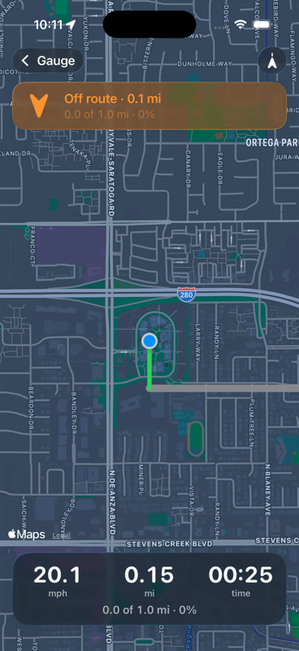</td>
    <td>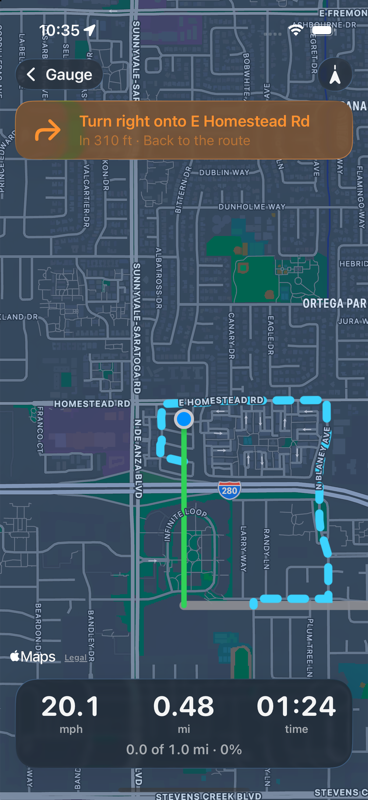</td>
  </tr>
  <tr>
    <td align="center">Following a route</td>
    <td align="center">Off route</td>
    <td align="center">Directions back</td>
  </tr>
</table>

### Navigate to a place

Search for a place (with suggestions as you type), pick a recent destination, or drop a pin. Apple's cycling route and any alternatives are shown before you set off. Once riding, you get Apple's step-by-step cues and the time left. If you go off course, a new route is planned from where you are. You get an "Arrived" message at the destination.

<table>
  <tr>
    <td>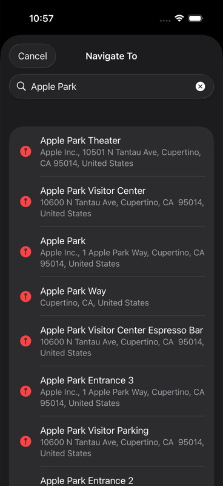</td>
    <td>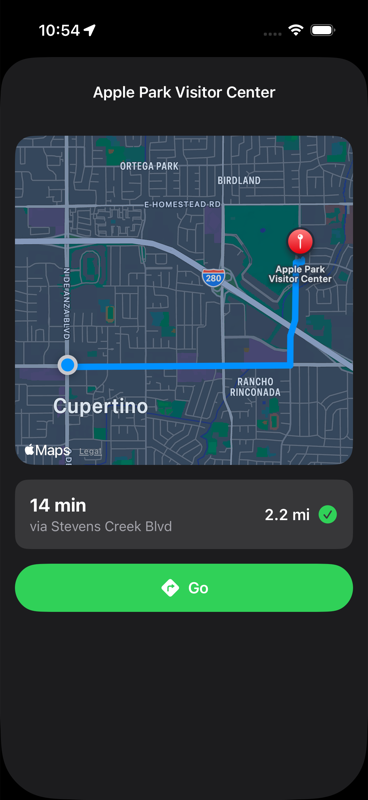</td>
    <td>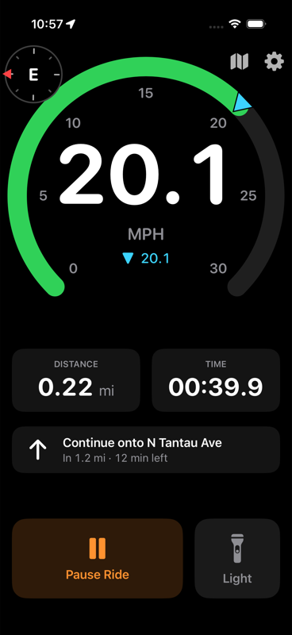</td>
  </tr>
  <tr>
    <td align="center">Search</td>
    <td align="center">Preview</td>
    <td align="center">Navigating</td>
  </tr>
</table>

### Live Activity

While you ride, speed, distance and time appear in the Dynamic Island and on the Lock Screen, along with the next turn when you're on a route. It also works while you navigate in another app.

### Settings

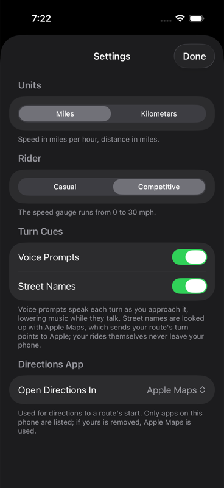

- Miles or kilometers
- Casual or competitive gauge scale
- Voice prompts on or off
- Street names on or off. Looking them up sends a route's turn points to Apple.
- Preferred directions app: Apple Maps, Google Maps or Citymapper (only installed apps are listed)

<br clear="right">

## Building

**Requirements:** Xcode 27 or newer, iOS 26 or newer, and [XcodeGen](https://github.com/yonaskolb/XcodeGen) (`brew install xcodegen`).

`project.yml` generates the Xcode project, which is checked in. Regenerate it after adding or removing files:

```sh
xcodegen generate
open CycleOdometer.xcodeproj
```

To run on a real device, set `DEVELOPMENT_TEAM` in `project.yml` to your own Apple team ID.

### Scripts

```sh
scripts/run_simulator.sh                    # build, install and launch in the iPhone 17 Pro simulator
scripts/run_simulator.sh --ride --screenshot # mid-ride on a simulated GPS route, then a PNG
scripts/run_simulator.sh --physical         # on a connected iPhone
scripts/run_simulator.sh --help             # every option
```

`scripts/deploy_testflight.sh` bumps the build number, runs the tests, archives, and uploads to TestFlight. It reads App Store Connect credentials from `scripts/.env`, which isn't in the repo. See `scripts/.env.example`.

### Tests

```sh
xcodebuild test -project CycleOdometer.xcodeproj -scheme CycleOdometer \
  -destination 'platform=iOS Simulator,name=iPhone 17,OS=latest'
```

The unit tests use Swift Testing. They cover:
- GPX reading and writing
- route matching, including loops, out-and-backs and figure-eights
- off-route detection
- turn detection
- street-name lookup, using a fake directions provider
- navigation and rerouting
- the Live Activity's update throttle
- voice prompt wording

## Project layout

| Path | What's there |
|---|---|
| `CycleOdometer/` | The app |
| `CycleOdometer/RideTracker.swift` | GPS, distance, speed, the stopwatch, and the guidance during a ride |
| `CycleOdometer/RouteFollower.swift` | Matching your position to a route: progress, off route, finished |
| `CycleOdometer/Turns.swift`, `Directions.swift` | Turn detection from a route's shape; Apple directions and street names |
| `CycleOdometerWidgets/` | The Live Activity (Dynamic Island and Lock Screen) |
| `CycleOdometerTests/` | Unit tests |
| `docs/features/routes-and-maps.md` | The design spec for routes, maps and navigation |
| `scripts/` | Simulator and TestFlight scripts |

## Privacy

Rides, tracks and routes are stored only on the phone. Apple's servers are used for:
- **Directions:** Ride to Start, directions back to a route, and navigation.
- **Street names**, when that setting is on.
- **Place search.**

Shared GPX files contain a route's shape and elevation, but no times or speeds.
